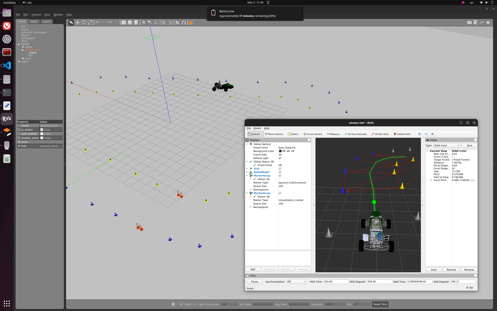

# *[NOTE]* *FULL VERSION IN UTSMA_DOC*
# Welcome to UTS Motorsports Autonomous Software Team!
Congratulations on joining us! This is likely to be (and recommended to be) the first Git repository you have seen from our team. It contains essential documentation and introductions that you might need to hit the ground running. Like any other GitHub repo of ours, you are welcome to contribute and be a part of it. Once again, warm welcome to the software team of UTS Motorsports Autonomous (UTSMA)!

  

Your journey with UTSMA starts here. Dive in, explore, and don't hesitate to reach out with your questions, ideas, or if you just want to chat about programming languages. 

## Upcoming Activities - Updated March 17th, 2024
- Onboarding Day Agenda - [Doc](https://docs.google.com/document/d/1aJJLS3kh583h26mIUbPcbX9Z9O1gO9NFjqotf0uAgFU/edit?usp=sharing)
- Design Review Schedule - [UTSMA Google Drive](https://drive.google.com/drive/folders/15ylyldXmXBeACkkLHzWmblHgWeRbWLl9?usp=sharing)

## Important Resources
- [Design Challenge 2024](design_challenge_2024/design_challenge_2024_main.md)

<b>More</b>

- USTMA Software System Overview (Presentation Slides) - [UTSMA Google Drive](https://docs.google.com/presentation/d/1zne05yfEJS1NjFWseucH3GLTtiT8GwhdV-NkSwT-K6s/edit?usp=sharing)
- FSAE-A Documents:
  - https://www.saea.com.au/formula-sae-a
  - https://www.saea.com.au/documents
- Docker for ROS1 System - [Simulation and Path Planning Demo](ros1_demo.md)
- Let someone know that you're borrowing any equipment and update the [following](https://drive.google.com/drive/folders/1s4RaXr7q4EpDUFmCq081W_j0JnPiPcAK?usp=sharing)
- Project Lead Documentation - [UTSMA Google Drive](https://drive.google.com/drive/folders/1TdFySK1vk3Zrb0MlMXAERZ5uGw8OwUny?usp=sharing)

## Category-specific Resources
We're currently undergoing a significant restructuring within various sections of the UTSMA software team. Our team leads are at hard work compiling documents to summarize what has been accomplished so far. To make it efficient, we hope to align our priorities of preparing the materials with your areas of interest. Share with us your preferred area of focus. Chances are you will be the pioneer in that category!

### Autonomous System Overview
- [UTSMA Google Drive](https://drive.google.com/drive/folders/1ksgJ-Ff40Uwp_a53CNsU_4nPnlklQnhM?usp=drive_link)
- [AMZ Driverless The Full Autonomous Racing System](media/AMZ%20Driverless%20The%20Full%20Autonomous%20Racing%20System.pdf)
- [Autonomous Driving System Design for Formula Student Driverless](media/Autonomous%20Driving%20System%20Design%20for%20Formula%20Student%20Driverless%20.pdf)
- [Racing With ROS 2 A Navigation System for an Autonomous Formula Student Race Car](media/Racing%20With%20ROS%202%20A%20Navigation%20System%20for%20an%20Autonomous%20Formula%20Student%20Race%20Car.pdf)
- [The Software Stack That Won the Formula Student Driverless Competition](media/The%20Software%20Stack%20That%20Won%20the%20Formula%20Student%20Driverless%20Competition.pdf)
- [Explorations and Lessons Learned in Building an Autonomous Formula SAEa Car from Simulations](media/Explorations%20and%20Lessons%20Learned%20in%20Building%20an%20Autonomous%20Formula%20SAEa%20Car%20from%20Simulations.pdf)

### Path Planning
* [Introduction and Guide to Path Planning](https://docs.google.com/document/d/1UwfvTsaPmcLQRIa7ISYW_C58mfb8HMV3/edit?usp=drive_link&ouid=106341816978141651777&rtpof=true&sd=true)

The track boundary needs to be explicitly derived and interpreted from the cones’ location. A geometry planner has been developed with good robustness under simulation environments. More research and implementation are in progress to increase adaptation to perception noise and testing against edge cases, ensuring correct track boundaries at any time step.

Our team current planning algorithm is a tree search based on Delaunay Triangulation:

  

### Robotic Operating System (ROS)
- Critical components successfully migrated to ROS 2! 
- [UTSMA Google Drive](https://drive.google.com/drive/folders/1Xom48hRUlfQoVRsp0umaFlYNcggQWsob?usp=drive_link)
- Check out [Data Distribution Service (DDS)](https://docs.ros.org/en/iron/Installation/DDS-Implementations.html). They have different variations and we may need to select one that is the most suitable. 

### Computer Vision
- [Google Drive](https://drive.google.com/drive/folders/1eHo876xr0HqshwWCaD4Fv1u5nRigDS7F?usp=drive_link)

As per the F-SAE format, the track is implicitly dictated by differently coloured cones on either side of the track. The autonomous car requires a perception component to identify and, if possible, localise the concerning the body coordinator frame of the vehicle. 

A typical setup for cone localisation is a camera, Light Detection and Ranging (LiDAR), or the fusion of both. The team is focusing on a stereo camera (Zed 2i and Zed X) with depth information. Zed cameras generally have good support for Deep Learning in Computer Vision and great performance in outdoor environments. This project is highly research-oriented - a team member has published a conference paper with a Deep Learning model for the cone detection task of motorsports - [link](media\Coord_light_yolov5.pdf). 

### Simulations

  

The team takes advantage of open-source robotics simulation packages. Additionally, a good foundation in simulation and software development practice has allowed extension and modification to such software packages. The Control System section is working on the integration a revised, more comprehensive dynamic model to the existing simulation. Other improvements, such as perception noise and custom steering kinematics, have also been scoped out. 

### Integration and Deployment
The team has some members who are experienced in Robot Operating Systems (ROS), which will be the deployment platform for high-level control autonomous software. Current projects include exploring the advanced features of ROS 2 for process monitoring and lifecycle, as well as performance management. The team fosters good software integration practice by containerisation using [Docker](#docker), which brings about standardisation and reliability for software development and deployment environment.

We have 2 computers for the autonomous system:
- Zotac mini PC 
- Jetson Orin Nano

Some work needs to be done to deploy the autonomous codebase into those computers, preferrably using [Docker](#docker).

### Vehicle Control Systems
This section focuses on deriving a mapping of the car’s current state and control signal to its actual dynamic behaviours in real-time. The control scheme being researched is Model Predictive Control (MPC), which involves modelling the car’s dynamics. It is among the state-of-the-art control systems, hence a challenging task. Promising progress has been made by the team’s current PhD student member (Khoa) and a capstone student (Antony). 

A more straightforward PID control system will be developed to ensure a functional alternative. A long-term goal for the team is to incorporate that dynamic Control System with learning and adapting capabilities from Reinforcement and Deep Learning. That section has just been initialised and will be progressed in parallel with the traditional approaches.

### Reinforcement-Learning Control
- [Shared resource](reinforcement_section.md)

### Networking 
- To be updated
- Check out Foxglove!

### High-performance programming and hardware configuration
Once the theoretical base and software prototype has been made, a team will be created to improve its deployment performance. Technical programming skills are required, commonly involving high-performance programming languages like C/C++ and hardware acceleration frameworks like OpenCL and CUDA.

### GStreamer - a pipeline for fast image transmission
- To be updated

## Getting Involved
## Development Tools and Practices
### [Docker](docker.md)
* Docker is an increasingly popular tool in the software domain and has proven its usefulness in robotics. By simplifying dependency management and promoting modularity, Docker allows our team to decide and follow on our software dependency standards efficiently. Moreover, Docker's seamless integration and deployment capabilities, with its excellent compatibility with version control systems like Git, significantly streamline the development process.

## [Open-source Software](open_source_software.md)
- Choosen codebase that serves as good references. 

